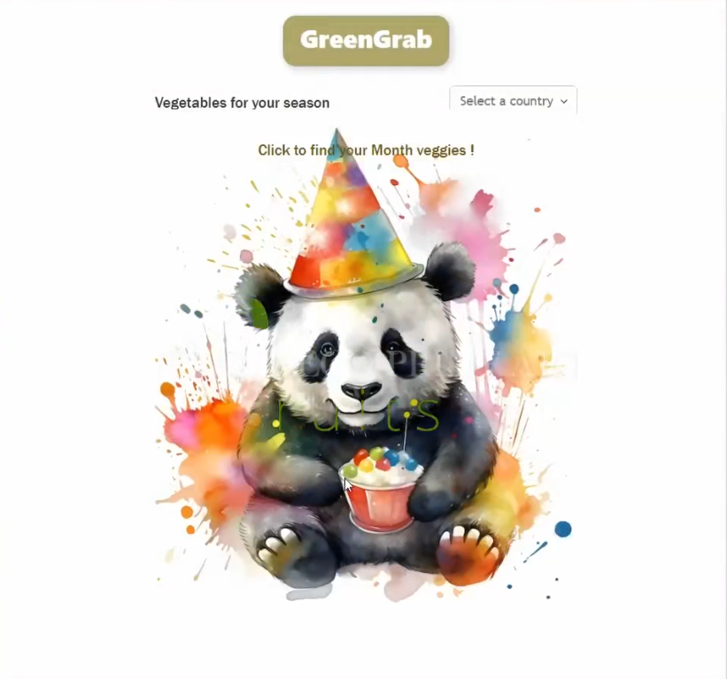

## GREENGRAB APP



This app allows you to check the available seasonal veggies and fruits available (currently only in Spain and Chile) for a selected Month. Eating/buying seasonal and local veggies and fruits is a great way to follow a more sustainable and respectful life in harmony with the environment. Project collaborators : @nalmarazgutierrez and @immatte Project supervision : @jbrcodes and @vic-fb

## Features:

1️⃣ Select the country 
2️⃣ Select the Month of the year
3️⃣ You can swap from veggies to fruits 

Feature added 🎉:

4️⃣ You can now click on a veggie or fruit image to have the name and some useful nutritional description details

Future updates to come : 
⚫ Add recipes section
⚫ Add a step NavBar on the top

<video src="https://github.com/immatte/3_Collaboration_GroMeal/assets/121168439/b4192166-1c6c-4eaa-ab72-b24e4e8c1463" title="GreenGrab Video">
Your browser does not support the video tag.
</video>

## Setup

### Dependencies

- Go to project directory (cd GreenGrab). Run `npm install` in project directory. This will install server-related dependencies such as `express`.
- `cd client` and run `npm install`. This will install client dependencies (React).

### Database Prep

The back-end database for the veggies and fruit was manually built up based on a GreenPeace calendar: https://es.greenpeace.org/es/frutas-verduras-temporada/calendario/

- Access the MySQL interface in your terminal by running `mysql -u root -p`
- Create a new database called what you want (xxxxx): `create database greengrab`
- Add (or verify) a `.env` file to the project folder of this repository containing the MySQL authentication information for MySQL user. For example:

```bash
DB_HOST=localhost
DB_NAME=greengrab
DB_USER=root
DB_PASS=root
```

- Run `npm run migrate` in the project folder of this repository (greengrab), in a new terminal window. This will create 5 tables called 'veggies', 'month_veggies', 'fruits', 'month_fruits' and 'countries' in your database.

- Make sure you understand how each table is constructed. In your MySQL console, you can run `use greengrab;` and then `describe veggies;` or `describe month_veggies;` or `describe fruits;` or `describe month_fruits;` or `describe countries;` to see the structure of the tables.

### Views and Components in Frontend(client)

### Routes

### Development

- Run `npm start` in project directory (my-express-app) to start the Express server on port 5000
- In another terminal, do `cd client` and run `npm start` to start the client in development mode with hot reloading in port 3000.